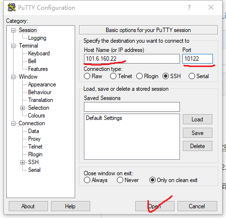

打开putty软件，

输入远程服务器地址：  本实验为  101.6.160.22

输入端口号：                   本实验为10122，10222，10322等由老师分配

选择ssh连接，点击OPEN即可进入linux系统，要输入用户名密码。用户名vr 密码vr123456

mac系统登录远程服务器的方法，使用内置命令ssh
    ssh vr@101.6.160.22 -p1xx22   
